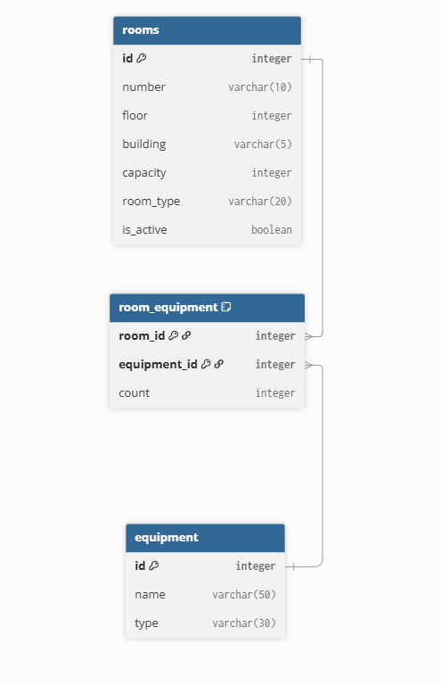

# Отчёт по Room Service (вариант 17)
**Группа:** 23-2П9  

**Оценка:** 3

**ФИО**: Юсуфов К.И.

## 1. Сущность «Аудитория» (Room)

### Создание аудитории

| Параметр          | Пояснение                        | Обязательность | Тип     | Ограничение                | Значение по умолчанию |
|-------------------|----------------------------------|----------------|---------|----------------------------|------------------------|
| number            | Номер аудитории                  | Да             | string  | длина 1..10                | -                      |
| floor             | Этаж                             | Да             | integer | 0..25                      | -                      |
| building          | Корпус                           | Да             | string  | 1..5 символов              | -                      |
| capacity          | Вместимость                      | Да             | integer | 1..500                     | -                      |
| room_type         | Тип (кабинет/лаборатория/мастерская) | Да        | string  | cabinet, lab, workshop     | -                      |

**Уникальная комбинация:**  
- `(number, building)`

**Возвращаемые данные (POST /rooms):**

| Параметр | Тип    |
|----------|--------|
| id       | integer|
| number   | string |
| floor    | integer|
| building | string |
| capacity | integer|
| room_type| string |
| is_active| bool   |

### Изменение аудитории по ID (PUT /rooms/{id})

| Параметр          | Пояснение                        | Обязательность | Тип     | Ограничение                |
|-------------------|----------------------------------|----------------|---------|----------------------------|
| number            | Номер аудитории                  | Нет            | string  | длина 1..10                |
| floor             | Этаж                             | Нет            | integer | 0..25                      |
| building          | Корпус                           | Нет            | string  | 1..5 символов              |
| capacity          | Вместимость                      | Нет            | integer | 1..500                     |
| room_type         | Тип                              | Нет            | string  | cabinet, lab, workshop     |

**Возвращаемые данные:**  
(те же, что при создании)

### Удаление (мягкое) (DELETE /rooms/{id})

Вернёт `true`, если запись помечена `is_active = false`, иначе `false`.

### Получение аудитории по ID (GET /rooms/{id})

| Параметр | Пояснение          | Тип    |
|----------|--------------------|--------|
| id       | ID аудитории       | integer|
| number   | Номер              | string |
| floor    | Этаж               | integer|
| building | Корпус             | string |
| capacity | Вместимость        | integer|
| room_type| Тип                | string |
| is_active| Активна ли запись  | bool   |

### Получение списка (GET /rooms)

**Параметры фильтрации:**

| Параметр    | Пояснение           | Тип     | Описание                |
|-------------|---------------------|---------|-------------------------|
| building    | Корпус              | string  | точное совпадение       |
| floor       | Этаж                | integer | точное совпадение       |
| room_type   | Тип                 | string  | cabinet/lab/workshop    |
| min_capacity| Мин. вместимость    | integer | >= значение             |
| is_active   | Активна             | bool    | true/false              |

**Возвращаемые данные:**  
Список объектов, как в `GET /rooms/{id}`.

## 2. Связь «многие ко многим» (Room ↔ Equipment)

Через транзитивную таблицу `room_equipment`.

### Сущность «Оборудование» (Equipment)

| Параметр | Пояснение     | Тип    | Ограничение      |
|----------|---------------|--------|------------------|
| id       | ID оборудования| integer| PK               |
| name     | Название      | string | уникально, 1..50 |
| type     | Тип           | string | projector, board, pc, etc. |

### Транзитивная таблица `room_equipment`

| Параметр   | Пояснение          | Тип     | Внешний ключ     |
|------------|--------------------|---------|------------------|
| room_id    | ID аудитории       | integer | → Room.id        |
| equipment_id | ID оборудования | integer | → Equipment.id   |
| count      | Количество         | integer | >= 1             |

Уникальная комбинация: `(room_id, equipment_id)`

## 3. ER-диаграмма



Транзитивная таблица `room_equipment` реализует связь M:N.

## 4. Файл `models.py` (реализация на peewee)

```python
from peewee import *

db = SqliteDatabase('rooms.db')

class BaseModel(Model):
    class Meta:
        database = db

class Room(BaseModel):
    number = CharField(max_length=10)
    floor = IntegerField()
    building = CharField(max_length=5)
    capacity = IntegerField()
    room_type = CharField(max_length=20)  # cabinet, lab, workshop
    is_active = BooleanField(default=True)

    class Meta:
        table_name = 'rooms'
        indexes = (
            (('number', 'building'), True),
        )

class Equipment(BaseModel):
    name = CharField(max_length=50, unique=True)
    type = CharField(max_length=30)

    class Meta:
        table_name = 'equipment'

class RoomEquipment(BaseModel):
    room = ForeignKeyField(Room, backref='equipment_list')
    equipment = ForeignKeyField(Equipment, backref='rooms_list')
    count = IntegerField(constraints=[Check('count >= 1')])

    class Meta:
        table_name = 'room_equipment'
        primary_key = CompositeKey('room', 'equipment')

def init_db():
    db.connect()
    db.create_tables([Room, Equipment, RoomEquipment], safe=True)
    db.close()
